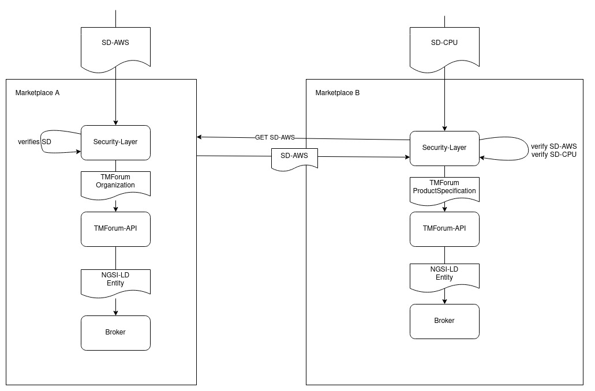

# Example mapping

Scenario: AWS offers a VM as an IaaS service in Frankfurt.
Involved credentials: 
- AWS as an officially registered company - [Self-Description of AWS](./SD_ORG.md)
- CPU as part of the offer and verified by NVIDIA as its producer - [Self-Description of the CPU](./SD_CPU.md)
- Switch as part of the offer and verified by CISCO as its producer - [Self-Description of the Switch](./SD_NETWORK.md)
- The offering, verified to be offered as shown in the marketplace by AWS - [Self-Description of the offering](./SD_SERVICE_OFFERING.md)

AWS is mapped directly to an TMForum Organization: [Json](./TMForum_ORG.md)

CPU and Switch are mapped as a Product Spec, but can be an Resource, too. The Service-Offering is mapped to a product offering, referencing the specs:
[Full-json](./TMForum_OFFER.md)

Example of a mapping to NGSI-LD for the organization: [NGSI-LD Organization](NGSI-LD-Org.md)

## Example flow for external ref

AWS is created in Marketplace A. When the spec for CPU is created(including its references to the operator AWS) in Marketplace B, the security layer extracts the Self-Description from Marketplace A and verifies the claims in that SD.
Additionally, all claims for the CPU are verified and the ProductSpecification is created at Marketplace B. The trust-chain is ensured to be intact after following the references. 

